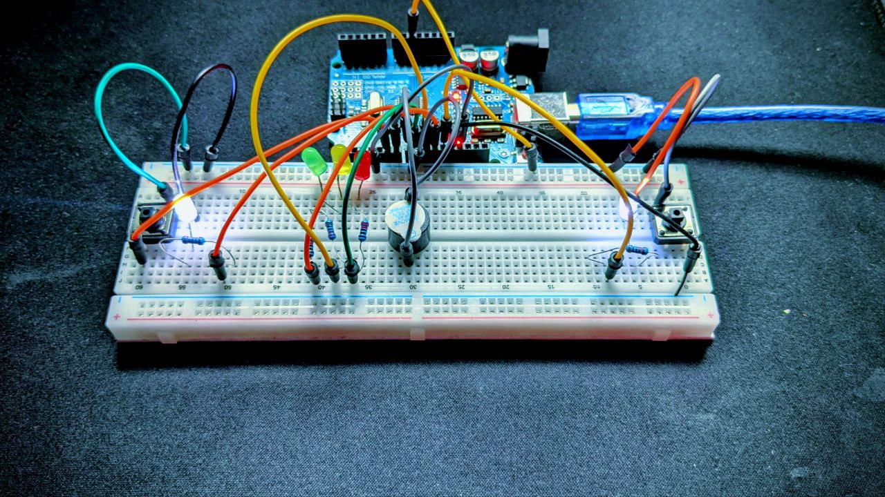

# Arduino-reaction-game

Ein kleines Reaktionsspiel mit zwei Spielern, das mit einem Arduino und einfachen elektronischen Bauteilen aufgebaut wurde.

#Ziel des Projekts

Das Ziel dieses Projekts war es, ein interaktives Spiel zu entwickeln, bei dem zwei Spieler so schnell wie möglich auf einen Knopf drücken müssen, sobald das Startsignal erscheint.

Dieses Projekt dient als Übung für grundlegende Konzepte der eingebetteten Programmierung und der Elektronik.

#Funktionsprinzip

Das System startet eine kurze Sequenz mit grüner, gelber und roter LED. Danach wartet das Programm eine zufällige Zeit. Zwei weiße LEDs signalisieren den Start.

Die Spieler müssen nun so schnell wie möglich ihren jeweiligen Button drücken. Der Spieler, der zuerst drückt, gewinnt und die LED des anderen Spielers wird ausgeschaltet.

Ein Summer (Buzzer) gibt akustisches Feedback.

#Verwendete Komponenten

Arduino Uno

Breadboard

LEDs (grün, gelb, rot, weiß)

2 Taster (Push Buttons)

Widerstände

Piezo Buzzer

#Lerninhalte

Während dieses Projekts wurden folgende Konzepte gelernt:

Verwendung von digitalen Ein- und Ausgängen

Nutzung von INPUT_PULLUP für Taster

Erzeugung von zufälligen Verzögerungen mit random()

Aufbau einer einfachen Spiel-Logik

Prototyping mit Breadboard

#Projektstruktur
buzzer_spiel.ino   -> Arduino Code
images/             -> Bilder des Aufbaus
video/              -> Demonstration des Spiels

#Mögliche Erweiterungen

Anzeige der Reaktionszeit im Serial Monitor

LCD-Display zur Anzeige des Gewinners

Speicherung von Highscores

Erweiterung zu einem Multiplayer-Spiel

#Autor

Octave Meba
Mechatronik Bachelor Student

